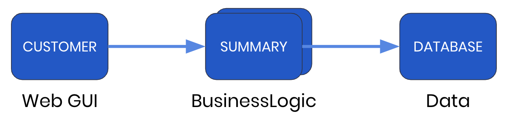

# GlobalNetworkPolicy

The following picture is a visual representation of YAOBank application tiers.



Calico _GlobalNetworkPolicy_ resource is a security policy rule that can affect your cluster as a whole. This type of resource can affect both namespace (traffic inside a cluster) and non-namespace (external and NIC) traffic.

Note: In this policy, traffic from non-namespaced and kube-system, calico-system, calico-apiserver namespaces are excluded deliberately to simplify the flow of content.

Use the following command to establish isolation.

## Connectivity check
First, let's verify if the customer pod can access the database directly.

Use the following command to access the database from one of the customer pods. 

```bash
kubectl exec -it -n yaobank-customer deployments/customer -- curl --connect-timeout 5 http://database.yaobank-database:2379/v2/keys?recursive=true | python -m json.tool
```

You should get a valid JSON response.

Let’s do the connectivity test again, but this time we are trying to access an external URL from a different namespace that is not explicitly denied.

```bash
kubectl exec -it -n yaobank-customer deployments/customer --  curl --connect-timeout 10 -LIs https://www.google.com/ | egrep HTTP
```
Response should be:
``` HTTP/2 200  ```

Use the following command to establish isolation.

```bash
kubectl apply -f https://raw.githubusercontent.com/erecica/Calico-AKS-BYOCNI/main/Exercises/02-GlobalNetworkPolicy/default-app-policy.yaml
```

## Security Policies
In addition to the GlobalNetworkPolicy resource, Calico also offers a NetworkPolicy resource that can be applied to namespaces individually. 

Use the following command to add the required rules.

```bash
kubectl apply -f https://raw.githubusercontent.com/erecica/Calico-AKS-BYOCNI/main/Exercises/02-GlobalNetworkPolicy/networkpolicy.yaml
```

Let’s do the connectivity tests again. Now we shouldn't be able to connect to the external address or to the database pod from the customer pods.

```bash
kubectl exec -it -n yaobank-customer deployments/customer --  curl --connect-timeout 10 -LIs https://www.google.com/ | egrep HTTP
```

```bash
kubectl exec -it -n yaobank-customer deployments/customer -- curl --connect-timeout 5 http://database.yaobank-database:2379/v2/keys?recursive=true | python -m json.tool
```

