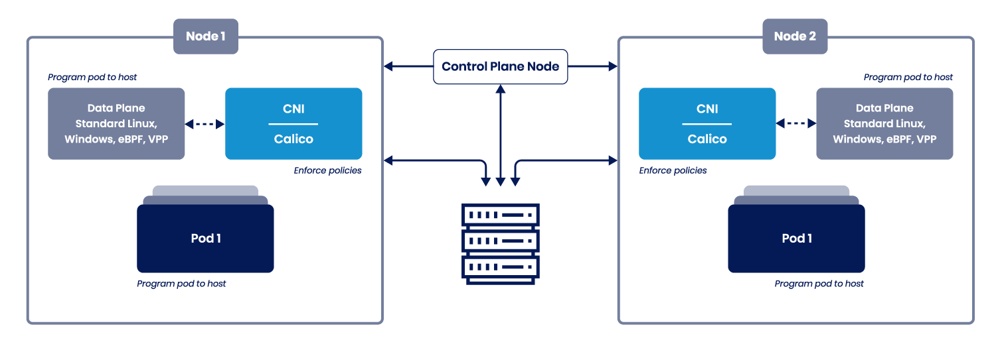

# Calico-AKS-BYOCNI
Install Calico on [Azure](https://learn.microsoft.com/en-us/azure/) AKS cluster with Bring Your Own CNI setup.

## Calico Open Source
Calico Open Source is a networking and security solution for containers, virtual machines, and native host-based workloads. It supports a broad range of platforms including Kubernetes, OpenShift, Docker EE, OpenStack, and bare metal services.

Whether you opt to use Calico’s eBPF data plane, Linux’s standard networking pipeline, or the Windows data plane, Calico delivers blazing-fast performance with true cloud-native scalability. Calico provides developers and cluster operators with a consistent experience and set of capabilities whether running in public cloud or on-premises, or on a single node or across a multi-thousand node cluster.



More information about [Tigera Calico website](https://www.tigera.io/tigera-products/calico/) 

This reposetory is setup for a Workshop purpuse and demsotrates how to install Calico on Azure [AKS with Bring Your Own CNI](https://learn.microsoft.com/en-us/azure/aks/use-byo-cni) setup. 

There are two methods to execute the steps to starup and clean up your AKS installation.

> **Warning**
> Microsoft will charge you a small fee when executing this demo! We strongly recomend to clean up the cluster after this demo! Clean up steps are included in this demo.

## Method 1
Clone and execute bash script

### 1. Clone this reposetory, cd into the folder, change execution promissons, setup the cluster and deploy the resources
```
git clone https://github.com/erecica/Calico-AKS-BYOCNI.git && \ 
cd Calico-AKS-BYOCNI && chmod +x *.sh && \
./start-script.sh
```
> **Note**
> After about 5-10 min the cluster should be ready and the demo app should be deployed

### Cleanup the cluster en remove all the resources

```
./cleanup-script.sh
```

## Method 2

Execute the commands maually

## Create resources commands

### 1. Create a resource group for this workshop
``` 
az group create --name Calico-AKS-Resourcegroup --location $LOCATION
```

### 2. Create AKS cluster with no Kubernetes CNI pre-installed

```
az aks create --resource-group Calico-AKS-Resourcegroup --name Calico-AKS-Workshop --location westeurope --pod-cidr 192.168.0.0/16 --network-plugin none --generate-ssh-keys
```
> Note: It might take about 6-9 min 

### 3. Get credentials to allow you to access the cluster with kubectl

```
az aks get-credentials --resource-group Calico-AKS-Resourcegroup --name Calico-AKS-Workshop
```

### 4. Install the operator

```
kubectl create -f ./tigera-operator.yaml
```

### 5. Configure the Calico installation

```
kubectl create -f ./tigera-operator-installation.yaml
```

### 6. Deploying YAOBank 

```
kubectl apply -f ./yaobank-org.yaml
```

### 7. Verify our deployment

```
kubectl get deployments -A | egrep yao
```

### 8. Deploying a Load Balancer

```
kubectl apply -f ./yoabank-loadbalancer.yaml
```

### 9. Verify the service deployment

```
kubectl get svc -n yaobank-customer yaobank-customer
```

> Note: It might take 1-2 minutes for the loadbalancer service to acquire an external IP address. Once the external IP is vissable, you should be able to visit the demo app with your breowser.

##  Clean up

### 1. Removing the AKS Cluster

```
az aks delete --name Calico-AKS-Workshop --resource-group Calico-AKS-Resourcegroup -y 
```
> Note: It might take 3-6 minutes to delete the cluster


### 2. Removing the Azure Resource Group

```
az group delete --resource-group Calico-AKS-Resourcegroup -y
```

### 3. Removing the AKS Kubeconfig Entries

```
kubectl config delete-cluster Calico-AKS-Workshop
kubectl config delete-context Calico-AKS-Workshop
kubectl config delete-user clusterUser_Calico-AKS-Resourcegroup_Calico-AKS-Workshop

```

### 4. Deleting the Cloud Shell Instance

```
clouddrive unmount
```
> You will be prompted to confirm twice.

>WARN: Removing a file share from Cloud Shell will terminate your current session.
Do you want to continue(y/n): y

> WARN: You will be prompted to create and mount a new file share on your next session.
Do you want to continue(y/n): y